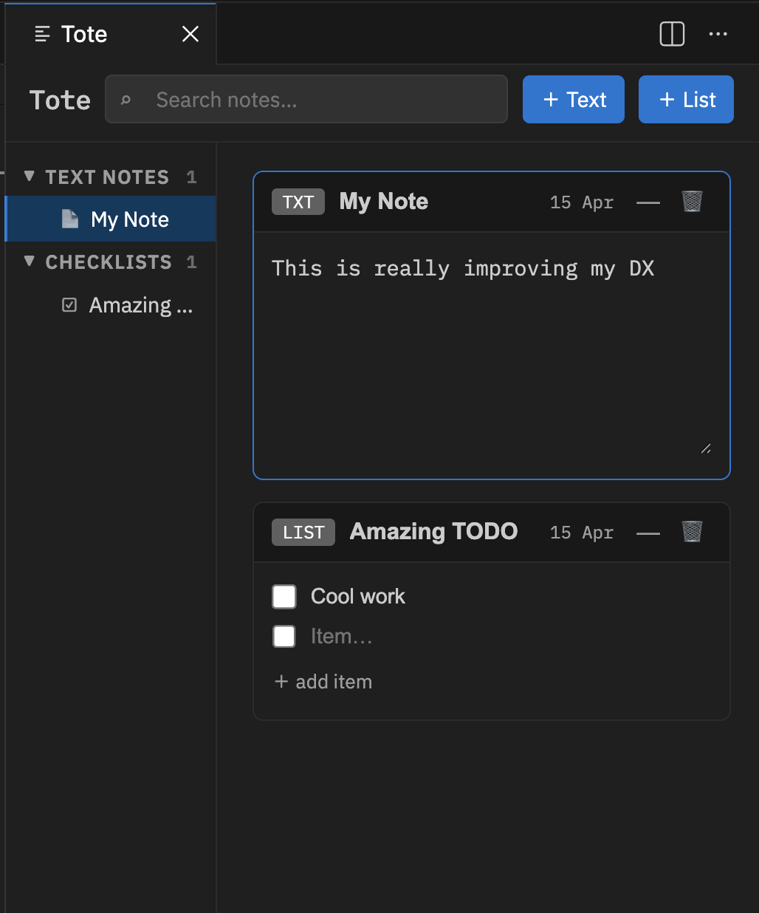

# Tote - A VSCode Extension for Temporary Notes & To-Do Lists

Tote is a simple yet powerful extension for Visual Studio Code that allows developers to easily take temporary notes and manage todo lists directly within the editor. Whether you're jotting down quick ideas, tracking tasks, or keeping important reminders within your workspace, Tote helps improve your development workflow (DX).

## Features

- Quick Notes: Create temporary notes right within your editor.
- Task Management: Easily add and check off tasks in a to-do list format.
- Auto-Save: Your notes and todos are automatically saved in your workspace, so you don't have to worry about losing them.
- Lightweight: Minimalistic design that doesn’t distract from your development process.
- Inline Editing: Update your tasks or notes without leaving your editor.

## Usage

Open the Tote Panel:

To access your notes and to-do list, open the Command Palette (`Ctrl+Shift+P` or `Cmd+Shift+P` on macOS) and run the following command:

```
Tote: Open
```

This will open the Tote panel in a column view, where you can add, edit, and manage your notes and tasks.

## Tote in Action


